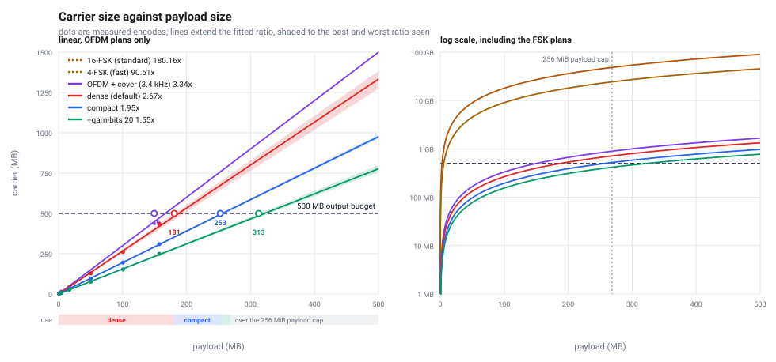
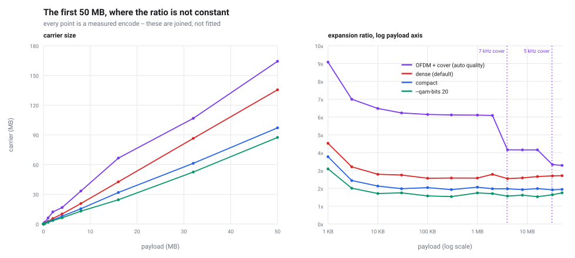
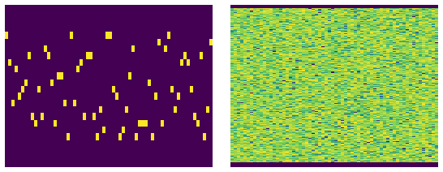
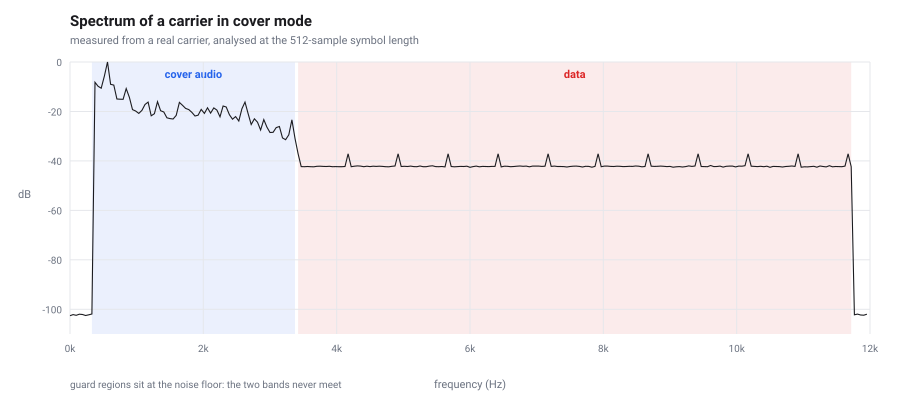
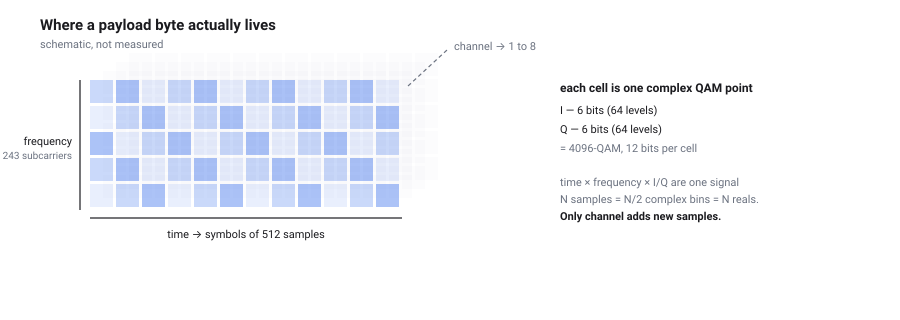

# stego-flac

Encapsulate files in acoustic waveforms stored as FLAC.

A payload is compressed, encrypted, erasure-coded, and modulated into an audible
carrier that any audio player will accept. The carrier is a standard mono 24 kHz
16-bit FLAC file — not a container with data hidden in it, but a file whose
*audio content is* the data.

```
encode:  file -> zstd -> AES-256-GCM -> RaptorQ -> OFDM/QAM -> FLAC
decode:  FLAC -> OFDM/QAM -> RaptorQ -> AES-256-GCM -> zstd -> file
```

## Status

Working end to end, with two physical layers: OFDM (default) and M-FSK.
A 20 MB file becomes a 36 MiB FLAC of 17 minutes — against 4 GB and 24 hours
for the original one-tone-at-a-time design.

Two playable carriers are committed, both holding the same encrypted copy of
*War and Peace*: [`test/warandpeace.flac`](test/warandpeace.flac) hides it under
a 1924 gramophone recording, [`test/warandpeace-plain.flac`](test/warandpeace-plain.flac)
does not. See [Two carriers you can play](#two-carriers-you-can-play).

## Contents

**Using it** — [Install](#install) · [Use](#use) · [Throughput](#throughput) ·
[How big the carrier gets](#how-big-the-carrier-gets) ·
[Two carriers you can play](#two-carriers-you-can-play) ·
[Radio mode](#radio-mode-hiding-the-data-under-audible-audio)

**How it works** — [Format reference](#format-reference) ·
[Filling the time-frequency plane](#filling-the-time-frequency-plane) ·
[Design notes](#design-notes) ·
[How the carrier describes itself](#how-the-carrier-describes-itself) ·
[The storage tensor](#the-storage-tensor-and-the---channels-axis)

**Measurements** — [Comparing the encodings](#comparing-the-encodings-axis-by-axis) ·
[What it does to real files](#what-it-does-to-real-files) ·
[Threading](#threading-and-where-the-time-goes) ·
[How much is left](#how-much-is-left) ·
[Over the air?](#would-this-work-between-two-nearby-devices)

**Reference** — [Reproducing everything here](#reproducing-everything-here) ·
[Layout](#layout) · [Tests](#tests) · [Limitations](#limitations)

## Install

```sh
cargo build --release
# target/release/stego-flac
```

Requires a Rust toolchain (edition 2021). No C dependencies beyond `zstd-sys`.

## Use

```sh
# Encode. Prompts for a passphrase, twice.
stego-flac encode secrets.txt

# Decode. No flags needed: the tone plan comes from the carrier's metadata
# and the output filename from inside the encrypted payload.
stego-flac decode secrets.txt.flac

# Half the duration and file size.
stego-flac encode big.pdf --profile fast

# Inspect a carrier without decoding it. Never asks for the passphrase.
stego-flac info secrets.txt.flac

# Show the tone plan and throughput budget for any configuration.
stego-flac plan --profile compact

# Pipe anything, including a whole directory.
tar czf - mydir | stego-flac encode - -o mydir.flac --name mydir.tar.gz
stego-flac decode mydir.flac -o - --quiet | tar xzf -

# Hide the data under audible music, so it sounds like a worn radio broadcast.
stego-flac encode secrets.txt --cover song.ogg

# ...and let the recording play to its end rather than being cut short.
stego-flac encode secrets.txt --cover song.ogg --cover-mode spread

# The cover band widens automatically for small payloads; pin it if you'd rather.
stego-flac encode secrets.txt --cover song.ogg --cover-quality telephone

# Spread the payload over several audio channels: same size, shorter carrier.
stego-flac encode big.bin --channels auto

# Shell completions.
stego-flac completions zsh > ~/.zfunc/_stego-flac
```

Cover audio may be FLAC, WAV, MP3, Ogg Vorbis, or the audio track of an
MP4/M4A, at any sample rate or channel count; it is downmixed and rate-matched
automatically.

`-` means standard input for `encode` and standard output for `decode`, so the
tool composes with `tar`, `gpg`, `curl` and anything else. When the payload goes
to stdout the summary moves to stderr, so pipes stay clean; `--quiet` silences
it entirely. A *carrier* cannot be streamed to stdout — FLAC's header records a
length and MD5 that are only known once encoding finishes, so it needs a
seekable file.

`decode` needs no configuration in the normal case. The tone plan is recorded
in the carrier's FLAC metadata; the original filename and the payload's format
are stored *inside* the encrypted payload. All three are recovered
automatically:

```
$ stego-flac encode quarterly.pdf
  filename stored    quarterly.pdf
  format detected    PDF document

$ stego-flac decode quarterly.pdf.flac
recovered 21.2 KiB to quarterly.pdf (PDF document)
```

The format is detected from the file's *content*, not its extension, which
matters when there is no filename at all — a piped payload is named from what
it turns out to be:

```
$ cat report.pdf | stego-flac encode - -o c.flac
  filename stored    payload.pdf
  format detected    PDF document
```

A stored name is always returned **exactly as given** — repairing a missing
extension was built and then removed, because the rule has no safe form: Unix
executables are conventionally extensionless, so `myprogram` would come back as
`myprogram.elf`. The detected format is reported instead.

Detection covers ~30 common signatures (PDF, PNG, JPEG, ZIP, gzip, MP3, MP4,
ELF, SQLite, …) by magic number only. There is no statistical sniffing:
unrecognised content simply has no format, because a confident wrong answer
would end up in a filename.

Pass `-o` to override the destination, tone-plan flags to override the recorded
plan, or `--no-store-name` to withhold both the name and the format.

Passphrases come from an interactive prompt, `--passphrase-file`, or
`AUDIO_MODEM_PASSPHRASE`. There is deliberately no `--passphrase` flag: an
argument is visible in `ps` to every user on the machine and lands in shell
history.

`--no-encrypt` writes a plaintext carrier and warns on stderr.

## Throughput

Three presets. The default fills the whole time-frequency plane; the two FSK
plans light one tone at a time and exist for readability, not speed.

| profile | waveform | rate | 20 MB becomes |
|---|---|---|---|
| `compact` | OFDM, 65536-QAM | **170.3 kbit/s** | 36.1 MiB, 17 m |
| `dense` (default) | OFDM, 4096-QAM | 127.7 kbit/s | 48.2 MiB, 22 m |
| `fast` | 4-FSK | 4 kbit/s | ~1.5 GB, 11 h |
| `standard` | 16-FSK | 2 kbit/s | ~3.6 GB, 22 h |

`compact` spends some of the margin `dense` keeps in reserve. Prefer it when the
carrier is stored and read back untouched; prefer `dense` if the file might be
converted, resampled, or passed through a gain stage.

Those are pre-compression figures; text typically shrinks 5-6x first. A 6.8 KiB
text file becomes a **4.9 KiB** carrier — smaller than the original. On that
20 MB row `dense` takes 3.0 s and 1.02 GiB of RAM; `standard` needs ~20 GiB and
would not complete on a 16 GiB machine.

## How big the carrier gets

The table above is per-profile. This is the same question asked as a function:
given a payload anywhere from nothing to half a gigabyte, how large is the
`.flac`?



Both panels plot the same six plans; the left one drops the FSK plans because
they leave the frame within the first few megabytes, and the right one keeps
them by going logarithmic. Dots are real encodes. Lines are the fitted ratio
carried out to 500 MB, and the open circles on the dashed line mark the largest
payload each plan can take while keeping the output under 500 MB.

| plan | carrier per payload byte | largest payload under 500 MB |
|---|---|---|
| `--qam-bits 20` | 1.57x | **268 MB** — the payload cap, not the size |
| `compact` | 1.95x | **252 MB** |
| `dense` (default) | 2.67x | **181 MB** |
| `dense` + `--cover` | 3.34x | **150 MB** |
| `fast` (4-FSK) | 90.6x | 5.5 MB |
| `standard` (16-FSK) | 180.2x | 2.8 MB |

The strip under the axis is the recommendation, and it is the least aggressive
plan that still fits the budget rather than the smallest one. `compact` and
`--qam-bits 20` pack more into each subcarrier, which costs margin: they are
measurably more fragile to any later resampling or gain change, and 22 bits
fails outright. So they are worth reaching for when size forces it and not
before.

| payload | use |
|---|---|
| up to 181 MB | `dense` — the default |
| 181-252 MB | `--profile compact` |
| 252-268 MB | `--qam-bits 20` |
| over 268 MB | nothing; `MAX_PAYLOAD_LEN` refuses it |

Two ceilings apply and the lower one wins. Below ~180 MB the binding constraint
is output size; above it, `MAX_PAYLOAD_LEN` — a hard 256 MiB (268 MB) refusal in
`pipeline.rs`, which is why `--qam-bits 20` gains nothing from its thinner
waveform past that point.

Extrapolating from a 150 MiB measurement to 500 MB is safe here because the
straight line is not an empirical fit — it is what the encoder does. Bit rate is
fixed by the plan, so carrier *duration* is exactly proportional to payload:
`dense` measures 70.00 s/MiB at 1 MiB and 70.05 s/MiB at 20 MiB. The 181 MB row
is not extrapolated anyway — a 182,000,000-byte payload was encoded end to end
and produced a 490,479,993-byte carrier, 3 h 22 m 40 s long, decoding
byte-identical.

### The first 50 MB, where the ratio bends

Duration is exactly linear, but the *file size* is duration times how many bytes
per second FLAC spends, and that second factor is not constant. Over 0-500 MB
the curvature is invisible; below 50 MB it is the whole story:



Nothing here is fitted — every point is an encode. Two things bend the curve,
in opposite directions.

**Below ~500 KB, fixed overhead dominates.** The 92-byte header, the 5% FEC
floor and the FLAC container are paid once regardless, so they are amortised
over less and less payload. `dense` costs 4.54x at 1 KB against 2.56x at 1 MB.
This is why a small file is a bad deal in *ratio* terms and an irrelevant one in
absolute terms: 4.54x of 1 KB is still 4.6 KB.

**From 1 MB to 20 MB the ratio climbs again**, 2.56x to 2.74x, then flattens.
The tempting explanation — random variation between payloads — is wrong:
repeating a fixed size varies by only ±0.3%, so this is a function of length.
What changes is the carrier's RMS:

| payload | carrier peak | carrier RMS | crest | FLAC bytes/s |
|---|---|---|---|---|
| 1 MiB | 29490 | 1575 | 18.7x | 37.6 KiB/s |
| 20 MiB | 29490 | 2977 | 9.9x | 40.1 KiB/s |

Normalisation pins the peak at 0.9 full scale, so both files end at exactly
29490. But the peak is an isolated transient in the last ~2% of the carrier —
the body sits near 1600 RMS throughout while the tail touches 29490. In a short
carrier that transient stands 18.7x above the body; in a long one, 9.9x. So the
short carrier's body is normalised roughly 6 dB quieter, its residuals are
smaller, and FLAC codes it more cheaply. Quieter is smaller, so the small file
wins on size — it is spending SNR margin it does not need on a lossless channel.

The purple line is `--cover`, and its step at 4 MB is the automatic cover
quality described in [Radio mode](#radio-mode-hiding-the-data-under-audible-audio):
below that threshold the cover is given 7 kHz of bandwidth instead of 3.4 kHz,
which sounds considerably better and costs subcarriers to do it.

## Comparing the encodings, axis by axis

Every configuration below carries the same 2 MiB of incompressible data, is
verified to round-trip byte-for-byte before it is reported, and is measured with
`tools/benchmark.py`:

```sh
cargo build --release
python3 tools/benchmark.py 2097152
```

| encoding | axes used | carrier | file | vs 1-D | encode | decode | peak RSS |
|---|---|---|---|---|---|---|---|
| 16-FSK mono | time only | 2 h 29 m 07 s | 360.2 MiB | 1x | 4.11 s | 2.50 s | 3071 MB |
| 4-FSK mono | time only | 1 h 14 m 34 s | 181.2 MiB | 2x | 0.91 s | 0.89 s | 2786 MB |
| OFDM QPSK | time x freq x 2-bit cell | 14 m 01 s | 31.7 MiB | 11x | 0.18 s | 0.14 s | 544 MB |
| OFDM 64-QAM | time x freq x 6-bit cell | 4 m 40 s | 10.4 MiB | 35x | 0.10 s | 0.05 s | 191 MB |
| OFDM 4096-QAM | time x freq x 12-bit cell | 2 m 20 s | 5.2 MiB | 70x | 0.13 s | 0.03 s | 118 MB |
| OFDM 65536-QAM | time x freq x 16-bit cell | 1 m 45 s | 3.8 MiB | 95x | 0.05 s | 0.03 s | 98 MB |
| OFDM 1M-QAM | time x freq x 20-bit cell | 1 m 24 s | 3.2 MiB | 111x | 0.04 s | 0.02 s | 87 MB |
| 4096-QAM, 2ch | + channel | 1 m 10 s | 5.5 MiB | 66x | 0.09 s | 0.04 s | 122 MB |
| 4096-QAM, 8ch | + channel | 17.5 s | 5.1 MiB | 70x | 0.06 s | 0.04 s | 121 MB |
| 65536-QAM, 8ch | + channel | 13.1 s | 4.4 MiB | 81x | 0.05 s | 0.03 s | 104 MB |

Four things fall out of that table, and only one of them was obvious in advance.

**Depth of the cell is the whole story.** Going from one-tone-at-a-time to a
filled plane at QPSK is already 11x. Everything after that is the *same* two
axes with more bits per cell: 2 -> 6 -> 12 -> 16 -> 20 bits takes it from 11x to
111x. The frequency axis is what makes parallel capacity possible; the
constellation is what actually spends it.

**Channels buy time, never bytes.** Eight channels cut the carrier from 2 m 20 s
to 17.5 s — almost exactly 8x — and left the file at 5.1 MiB against 5.2 MiB.
Detail in [the storage tensor](#the-storage-tensor-and-the---channels-axis).

**Memory and time track carrier duration, not payload.** The payload is 2 MiB in
every row; peak RSS runs from 3071 MB down to 87 MB, a 35x spread, in lockstep
with duration. Everything is held in RAM as samples — `f32` working buffer,
`i16` for the container, `i32` for the FLAC encoder — so cost is set by how many
samples the waveform needs, not how much data is in them. That is also why the
original 1-D design could not encode 20 MB on a 16 GiB machine: it is not slow,
it is enormous.

**Decoding is consistently faster than encoding**, roughly 2x, and the gap is
not the FFT. Demodulation is parallel and reads only the data bins; encoding
also runs zstd, RaptorQ and the FLAC encoder, and FLAC compression is the
single largest term once the waveform is cheap.

The `vs 1-D` column is file size against 16-FSK. It is not the same as the
throughput ratio, because FLAC compresses the sparse FSK carrier slightly better
than the noise-like OFDM one — a small mercy that does not come close to
offsetting a 60x difference in how many samples have to exist in the first
place.

That first row is not a strawman: it is what this project originally was, a
single tone at a time traced through the plane. Checked out of git history and
compiled rather than quoted from memory, the old build put 2 MiB into 423.6 MB
over 2 h 29 m using 3,519 MB of RAM. Expansion against the payload went from
**202x to 1.89x**, and at 20 MB the argument stops being about efficiency: the
original needed ~32.8 GiB and 23.7 hours, so it could not have run at all on a
16 GiB machine.

## Filling the time-frequency plane

M-FSK is a *one-of-M* code. Sixteen tones exist, exactly one is on, and the
choice of which carries `log2(16) = 4` bits. Fifteen sixteenths of the occupied
spectrum is silent at any instant — the signal is a line drawn through the
time-frequency plane.

OFDM fills the plane. Every subcarrier is active in every symbol, each carrying
an independent QAM point:



*Spectrograms of the two waveforms, 64 symbols each, frequency 0-12 kHz
vertically and time horizontally. Each is transformed at its own symbol length —
48 samples for FSK, 512 for OFDM — because analysing both with one window smears
ten FSK symbols into every column and the hopping disappears. Left: one bright
cell per column, the rest genuinely empty. Right: every subcarrier carrying a
QAM point in every symbol. Generated by `tools/figures.py` from the documented
tone plans.*

That is a 64x throughput gain and a ~60x smaller file, for the same audio
bandwidth. Three things make it work:

**No cyclic prefix.** Every real OFDM system prefixes each symbol with a copy of
its tail to absorb multipath echo, costing 7-25% of the payload. This channel is
a file: bit-exact, no echo, no delay spread, no timing offset. There is no
inter-symbol interference to absorb, so the prefix is omitted entirely.

**The quantisation floor is far away.** Signal RMS sits ~12 dB below full scale,
giving ~88 dB against the 16-bit floor and ~89 dB per bin. Shannon puts that at
~30 bits/bin; the default uses 12, leaving ~43 dB of margin. Errors here are
logic bugs, not noise, which is why the tests assert *exact* recovery rather
than an acceptable error rate.

**Exact peak normalisation.** An OFDM sample is a sum of hundreds of
subcarriers, so by the central limit theorem its amplitude is near-Gaussian and
unbounded. A real-time transmitter must guess a crest factor and accept
clipping. This encoder is offline and holds the whole carrier, so it measures
the true peak and scales to it exactly — clipping becomes structurally
impossible. (A 4-sigma guess overshot full scale by 1.8x and put 83 byte errors
into a 1024-QAM decode.)

### Pilot subcarriers, and why power-based gain fails

One subcarrier in sixteen carries a fixed known point instead of data, costing
~6% of throughput. It buys the receiver a gain reference that does not depend on
the payload, and that turns out to be essential rather than a nicety.

The tempting alternative is to infer gain from received power, leaning on the
constellation having unit average energy. It does not work. A symbol's
*realised* power `P` deviates from 1 according to the data it happens to carry,
and a power-based estimator returns `p/sqrt(P)` — the data's power variation is
algebraically indistinguishable from channel gain.

It fails hardest exactly where it matters. When a payload ends mid-symbol the
unused bins are fed zero bits, which Gray-map to the outermost corner point, so
a partially filled symbol carries roughly three times normal power. Observed:
a 1652-byte frame decoded cleanly for two symbols and then collapsed at bit
5832 — precisely the first partial symbol — while a 1 MB payload of the same
configuration decoded perfectly, because a million bytes average the sampling
error away. Pilots remove the circularity by putting a known value on the wire.

A side benefit: since gain is measured rather than assumed, a carrier that has
been volume-normalised or re-encoded at a different level still decodes. There
is a test for it.

## Format reference

The frame is a fixed 92-byte header followed by RaptorQ packets. Everything the
decoder needs to interpret the payload is in it; everything that would leak
something about the payload is not.

```
 off  len  field                     notes
   0    4  magic "AMDM"
   4    1  version                   1
   5    1  flags                     bit0 compressed   bit1 encrypted
                                     bit2 fec          bit3 named
                                     bit4 format       bit5 timestamp
   6    2  reserved
   8    8  original_len              envelope bytes before compression
  16    8  ciphertext_len            bytes handed to the FEC layer
  24    8  fec_payload_len           packet bytes after this header
  32   16  argon2id salt
  48   12  AES-GCM nonce
  60   12  RaptorQ OTI
  72    4  argon2id m_cost (KiB)
  76    4  argon2id t_cost
  80    4  argon2id p_cost
  84    2  fec symbol size
  86    2  reserved
  88    4  CRC-32 over bytes 0..88
```

The header is **authenticated but not confidential** — it has to be, because
the salt, nonce and KDF costs are inputs *to* decryption, so a decoder that had
to decrypt the header first would be stuck in a loop. The security-relevant
fields are fed to AES-GCM as additional authenticated data, so editing a length
or clearing the encrypted flag invalidates the tag. The CRC-32 is not a security
control; it distinguishes "the demodulator produced garbage" from "this is not
our file", before any length is trusted enough to size an allocation.

### The payload envelope

Inside the encryption, before the file contents:

```
  [u16 name_len][name]      when FLAG_NAMED
  [u8  fmt_len ][format]    when FLAG_FORMAT
  [u64 unix_seconds]        when FLAG_TIME
  [file contents]
```

Each block is independent, so a piped payload can carry a format and no name.
All three live here rather than in the header for the same reason: a filename,
a file type and a creation time are frequently more revealing than the bytes
they describe.

### Pipeline order

```
  encode:  plaintext -> envelope -> zstd -> AES-256-GCM -> RaptorQ -> modulate
  decode:  demodulate -> RaptorQ -> AES-256-GCM -> zstd -> envelope -> plaintext
```

The order is forced, not chosen. **Compress before encrypt**, because ciphertext
is incompressible. **Encrypt before FEC**, so the GCM tag covers exactly what
RaptorQ reconstructed — coding first would compute repair symbols over plaintext
and force the receiver to process untrusted data before it could authenticate
anything.

### Numbers for the default profile

| quantity | value |
|---|---|
| sample rate | 24 000 Hz |
| FFT size `N` | 512 samples (21.33 ms) |
| bin width | 46.875 Hz |
| symbol rate | 46.875 baud |
| subcarriers | 243, bins 8..250 (375-11719 Hz) |
| pilots | 16, every 16th subcarrier |
| data subcarriers | 227 |
| constellation | 4096-QAM, 12 bits per subcarrier |
| bits per symbol | 2724 (340.5 bytes) |
| throughput | 127 688 bit/s |
| expansion | 3.01x raw PCM |
| SNR per bin | ~89 dB against the 16-bit floor |
| margin at 4096-QAM | ~43 dB |

## Design notes

### Bin-aligned M-FSK (the `standard` and `fast` profiles)

Tone frequencies are not chosen in Hz. Each is pinned to an exact DFT bin of the
symbol window, `f_i = m_i · fs / N` for integer `m_i`. Three properties follow,
and the implementation depends on all three:

1. **Exact non-coherent orthogonality.** Spacing becomes `Δf = k·fs/N = k/T`,
   precisely the condition for orthogonality under magnitude detection, holding
   in integer arithmetic rather than approximately.
2. **Zero spectral leakage.** An integer number of cycles per symbol makes the
   rectangular analysis window coherent with the tone, so all energy lands in
   one bin. Measured worst-case adjacent-tone rejection is **152.9 dB**, which
   is the `f32` waveform quantisation floor rather than anything modulation
   contributes. No window function is applied — a Hann window here would
   *widen* the response and manufacture the leakage it normally suppresses.
3. **Automatic phase continuity.** Every symbol starts and ends at a zero
   crossing with zero phase, so symbols concatenate in any order without a
   discontinuity. There is no phase accumulator, and the modulator collapses to
   a 3 KiB lookup table with no runtime trigonometry.

Detection is a Goertzel argmax over the 16 candidate bins, which is the
maximum-likelihood rule for non-coherent M-FSK and needs no amplitude reference.

The default plan: 24 kHz, `N = 48` (500 baud, 500 Hz bins), 16 tones on bins
4–19 (2000–9500 Hz), 4 bits/symbol. Four bits is deliberate — one symbol is one
nibble, so no payload byte ever straddles a symbol boundary.

### What FEC actually buys

Nothing, when the file arrives intact — a bit-exact FLAC has no erasures. It is
on by default because the erasure it protects against is real for this format: a
**truncated file**, from a failed upload, a duration cap, or a trimmed tail.
RaptorQ reconstructs from any sufficiently large subset of packets, so a clipped
end is survivable up to the repair overhead. Measured, at the 5% default on a
small payload:

```
95% of carrier -> recovered
85% of carrier -> recovered
80% of carrier -> RaptorQ could not reconstruct the payload from 4 packets
```

Set `--fec-overhead 0` for archival transport where the file is known intact;
the layer then costs ~1.6% for packet framing.

One caveat with the dense waveform: a small payload now fits in one or two FLAC
blocks, and clipping a file mid-block destroys that whole block rather than a
tail. Truncation resilience is therefore coarser than it was at 2 kbit/s.

### Header authentication

The 92-byte header cannot be encrypted — the salt, nonce, and KDF costs in it
are the inputs *to* decryption. It is instead **authenticated but not
confidential**: security-relevant fields are fed to AES-GCM as additional
authenticated data, so editing a declared length or clearing the "encrypted"
flag invalidates the tag. The CRC-32 is an integrity check for demodulation
errors, not a security control; anyone who can rewrite the payload can recompute
it. Tests cover exactly this — tampering with a header field *and repairing the
CRC* still fails.

The envelope also records **when** the payload was encoded, in Unix seconds.
That sits inside the encryption with everything else: when a file was made is
frequently as telling as what is in it, so a plaintext timestamp would date
every carrier for anyone holding one.

Both the filename and the detected format live inside the encrypted envelope,
not in the header or the tags. "This carrier holds a PDF called
`tax-return-2024.pdf`" is exactly what the encryption is for; a test asserts
neither string appears anywhere in the frame in cleartext.

The header leaks that the file is an audio-modem carrier, the plaintext size,
and the KDF parameters. Hiding the first is a steganography problem this format
does not attempt.

### FLAC compresses this badly, and that is expected

The intuition that FLAC should crush a signal made entirely of pure tones is
wrong. Measured on the same carrier:

| symbol stream | FLAC size vs raw PCM |
|---|---|
| one constant tone | 30.2% (3.31×) |
| two tones alternating | 67.8% (1.47×) |
| uniformly random symbols | **98.7% (1.01×)** |

Linear prediction models a *stationary* sinusoid well, but the predictor is
invalidated at every symbol boundary — every 48 samples — and the error burst
forces the Rice coder to widen its parameter across the partition. Aligning
FLAC's block size to the symbol length makes it *worse*, because per-frame LPC
coefficient overhead then dominates.

The bottom row is the operative one: a real payload is encrypted, and ciphertext
is uniformly random by construction, so **encryption guarantees FLAC's worst
case**. FLAC is chosen for interoperability, not compression. Expect the file to
be roughly `16 bits/sample ÷ 4 bits/symbol × 48 samples/symbol = 192×` the frame
size, whatever the codec.

## How the carrier describes itself

The tone plan cannot live in the modulated audio: you need it in order to
demodulate anything, including a header that would describe it. It goes in a
FLAC `VORBIS_COMMENT` block instead, which sits *outside* the audio stream and
is readable as plain bytes:

```
$ metaflac --list --block-type=VORBIS_COMMENT secrets.txt.flac
  vendor string: stego-flac 0.1.0
  comments: 5
    comment[0]: TITLE=audio-modem carrier
    comment[1]: DESCRIPTION=audio-modem carrier, 6.8 KiB payload, encrypted
    comment[2]: ENCODER=stego-flac 0.1.0
    comment[3]: AUDIOMODEM_PLAN=mode=ofdm;fs=24000;n=512;base=8;top=250;qbits=12;amp=0.9
    comment[4]: AUDIOMODEM_PROFILE=dense
```

These tags are **not authenticated** — anyone can rewrite them, and a tampered
plan simply demodulates to something that fails the header CRC. Nothing
security-relevant is stored there. In particular the *filename* is not: it lives
inside the encrypted payload, because filenames are often more revealing than
the bytes they label.

The plan records the waveform too, so a carrier written with any profile decodes
with no flags. A plan string with no `mode` field is read as FSK, which is what
carriers written before OFDM existed look like.

Resolution order for the plan is: explicit flag, then `--profile`, then the
carrier's metadata, then the built-in default. If the tags are stripped, pass
the same flags used to encode. A genuine mismatch is still diagnosed clearly:

```
Error: bad magic [11, 01, 13, 00]: this audio was not produced by audio-modem,
or the tone plan differs
```

## It really is an audio file

Not a container with data smuggled in — the audio content *is* the data, and the
file is a standards-compliant FLAC. Verified against three independent decoders,
none of which is the library used to write it:

| check | result |
|---|---|
| `flac -t` (reference libFLAC) | ok, STREAMINFO MD5 verified |
| `afconvert` (Apple CoreAudio) | decodes to PCM |
| reference vs CoreAudio PCM | **bit-identical** |
| `metaflac --list` | reads all five tags |

Levels are well-behaved too: peak exactly -12.0 dBFS, RMS -15.2 dBFS, zero
clipped samples, no DC offset. `--amplitude` trades loudness for size — FLAC's
residuals scale with amplitude, so a quieter carrier is a smaller file:

| amplitude | file size |
|---|---|
| 0.8 | 297 KB |
| 0.25 (default) | 265 KB |
| 0.05 | 222 KB |
| 0.01 | 177 KB |

Detection is an `argmax` over bin powers and therefore completely gain-invariant,
so all of these decode identically. The default keeps ~78 dB of margin over the
16-bit noise floor, which leaves room for an acoustic front end later.

Be aware that it is a wall of pure tones in the most piercing part of the
hearing range. It is *playable*, not pleasant.

## Two carriers you can play

Both hold the **same** file — Tolstoy's *War and Peace* from Project Gutenberg,
a 1.8 MiB epub — encrypted with AES-256-GCM and recoverable byte-for-byte. They
differ only in whether the data hides under audible music.

| | [`warandpeace.flac`](test/warandpeace.flac) | [`warandpeace-plain.flac`](test/warandpeace-plain.flac) |
|---|---|---|
| sounds like | a 1924 gramophone record under static | static |
| file size | 5,732,907 B (5.5 MiB) | **4,848,036 B (4.6 MiB)** |
| duration | 2 m 48 s | **2 m 03 s** |
| samples | 4 026 368 | 2 945 024 |
| container | 24 kHz, mono, 16-bit FLAC | 24 kHz, mono, 16-bit FLAC |
| waveform | OFDM, **178** subcarriers x 4096-QAM | OFDM, **243** subcarriers x 4096-QAM |
| data band | 3422-11719 Hz | 375-11719 Hz |
| cover band | 375-3375 Hz, data 25 dB below | — |
| throughput | 93 375 bit/s | **127 688 bit/s** |
| expansion | 3.13x the epub | **2.66x the epub** |
| audio MD5 | `258cba6a15c5151983b15da7161990a2` | `6cb9124f31628ee0ec7d3fdecde50bb2` |

Shared by both: zstd skipped (an epub is a ZIP, and the probe detects that), FEC
at 5% repair over 256-byte RaptorQ symbols, Argon2id at m=64 MiB t=3 p=1, and a
frame of 1.9 MiB — 1.07x the payload, which is the FEC and framing overhead.
The filename and the detected type (`ZIP archive`) travel inside the encryption,
so `info` will confirm they exist but not reveal them.

The cover is Marion Harris singing *Tea for Two*, recorded 1924 and in the public
domain, supplied as a 48 kHz stereo Ogg Vorbis file and downmixed to 24 kHz mono
automatically. At 2 m 48 s the carrier is shorter than the recording, so it does
not even loop.

This carrier predates automatic cover quality and uses the telephone band, which
is why it is 5.5 MiB. Its 1.9 MiB frame is under the 4 MiB threshold, so today's
default would hand it the 7 kHz band instead — better sounding, and roughly
twice the size. It is kept as it is because a 10 MB demo file is a poor thing to
put in a repository; `--cover-quality telephone` reproduces it exactly.

```sh
afplay test/warandpeace.flac          # or any player: it is an ordinary FLAC
flac -t test/warandpeace.flac         # reference decoder agrees

stego-flac info test/warandpeace.flac
stego-flac decode test/warandpeace.flac -o out.epub   # passphrase: tolstoy-test
```

### Two cover modes

A recording is almost never exactly as long as the data needs, so there is a
choice about what to do with the difference.

```sh
stego-flac encode secret.bin --cover song.ogg                      # cut (default)
stego-flac encode secret.bin --cover song.ogg --cover-mode spread  # spread
```

**`cut`** ends the carrier when the payload does. Simple, smallest, and the
recording is truncated wherever the data happens to run out — mid-phrase, most
of the time.

**`spread`** deals the data out evenly across the whole cover instead, so the
recording plays to its end. Data symbols are placed every *n*-th symbol, and the
symbols between them carry cover audio with no data and no pilots at all. The
receiver skips them, which it can because the stride travels in the plan:

```
AUDIOMODEM_PLAN=mode=ofdm;...;cover=72;atten=25;spread=49
```

The stride is `cover_symbols / data_symbols`, floored, and whatever remainder
that integer division cannot express is filled with cover-only symbols at the
tail. Both parts are needed: the stride alone leaves up to one stride of
recording unplayed, which for a 3-minute song can be fifteen seconds of missing
ending.

Measured against a 3 m 02 s recording:

| payload | `cut` | `spread` |
|---|---|---|
| 1.8 MiB epub | 2 m 48 s, 5.5 MiB | 3 m 03 s, 5.8 MiB |
| 40 KB | **3.7 s**, cover barely starts | **3 m 02 s**, plays in full |

The second row is the case the mode exists for. A 3.7-second clip of a song is
obviously a fragment; three minutes of the same song with the payload dealt
thinly through it is not. The cost is proportional — a carrier as long as the
cover, and a file to match — so `cut` stays the default for when size is what
matters.

Spread does nothing when the data already outlasts the cover; there is nothing
to stretch into, and the cover loops as it always did.

### What the camouflage costs

At the telephone tier, measured on identical input: **+18%** file size (5.5 vs
4.6 MiB), **+37%** duration (2 m 48 s vs 2 m 03 s), −27% throughput (65 of 243
subcarriers handed to the cover). A smaller payload gets a wider band and pays
more — see [the tiers](#how-wide-the-cover-band-gets-and-why-size-decides-it).

Worth recording because the obvious estimate is wrong. FLAC does compress music
better than noise — the cover carrier packs 7.7 MiB of raw PCM into 5.5 MiB, a
1.4x win, where the plain one gets essentially nothing — but that only partly
offsets the narrower data band. Cover mode is cheap, not free.

## What it does to real files

The suite carries genuinely valid files, not random bytes: a PDF macOS
QuickLook renders, a PNG `sips` reads as 320x240 RGB, archives the system
`gzip -t` and `unzip -t` accept. Every fixture is generated in-process so the
tests stay hermetic, and a separate test hands them to the operating system's
own tools so "valid" is a claim about something other than our own code.

Measured carrier size for each, at the default profile with encryption on:

| format | input | carrier | ratio |
|---|---|---|---|
| JSON records | 184 KiB | 11.0 KiB | **0.06x** |
| gzip archive (real DEFLATE) | 3.1 KiB | 6.0 KiB | 1.93x |
| PDF, 6 pages | 21.2 KiB | 4.4 KiB | **0.21x** |
| CSV, 5000 rows | 208 KiB | 40.6 KiB | 0.20x |
| Rust source | 19.6 KiB | 3.8 KiB | 0.19x |
| Markdown | 9.4 KiB | 3.1 KiB | 0.33x |
| PNG, 320x240 | 225 KiB | 577 KiB | 2.56x |
| media-like (incompressible) | 293 KiB | 753 KiB | 2.57x |
| empty file | 0 B | 2.2 KiB | - |

Text-shaped formats come out **smaller than the original** — compression runs
before modulation, and a PDF or a JSON file shrinks far more than the 3x the
carrier costs. Already-compressed formats (archives, photos, video) cannot
shrink, so they pay the full expansion. The ~2.2 KiB floor is the frame header
plus the minimum RaptorQ packet set, which dominates for tiny payloads.

Filenames are covered too: spaces, non-ASCII (`計画書-v2 (最終).txt`), no
extension, and a stored name of `../../escaped.txt`, which is reduced to its
final component so a crafted carrier cannot write outside the working
directory.

## Threading and where the time goes

Demodulation was parallel from the start and modulation is now too: symbols are
independent — no cyclic prefix, no channel memory, nothing crosses a boundary —
so both fan out across cores with `rayon`. That is the "multi-threaded download"
decomposition, and it is exactly why OFDM works here at all.

It is also not where the time was. Measured on 20 MB of incompressible data,
8 threads:

| phase | before | after | parallel |
|---|---|---|---|
| `encode_frame` (zstd + RaptorQ) | 2.340 s | **0.227 s** | no |
| `modulate` (inverse FFT) | 0.357 s | **0.066 s** | yes |
| `demodulate` (forward FFT) | 0.070 s | 0.069 s | yes |
| `to_i16` / `from_i16` | 0.021 s | 0.022 s | no |
| `decode_frame` (RaptorQ) | 0.027 s | 0.028 s | no |
| **total** | **2.816 s** | **0.411 s** | |

Decoding 32 million samples takes 69 ms. Threading it harder would gain
nothing; it was already 2.5% of the work.

The real cost was compression. The default zstd level is 19, which is right when
there is something to find, but it has no early exit on incompressible input —
it ground for 2.16 s on 20 MB of random bytes and returned something *larger*
than the input, which was then discarded. A level-1 probe reaches the same
verdict in 3 ms, so the expensive pass is now only attempted when the probe sees
real structure. Already-compressed payloads (archives, photos, video, anything
encrypted) are the common case here and now skip it almost for free.

End to end on 20 MB: **2.99 s to 1.02 s**, the remainder being FLAC encoding and
file I/O.

## How much is left

A mono 16-bit file at 24 kHz is a fixed container: 384 kbit per second of audio,
and no representation changes that. The time-frequency plane is not extra room —
it is the same signal viewed differently, with exactly the same degrees of
freedom (`N` real samples correspond to `N/2` complex bins, which is `N` real
numbers again). What is left is *depth per cell*, and it is measurable:

| `--qam-bits` | constellation | bit/sample | of 16 | file vs raw PCM | 20 MB becomes |
|---|---|---|---|---|---|
| 12 (default) | 4096-QAM | 5.32 | 33% | 3.01x | 48.2 MiB, 22 m |
| 16 | 65536-QAM | 7.09 | 44% | 2.26x | 36.1 MiB, 17 m |
| 20 | 1048576-QAM | 8.87 | 55% | 1.80x | — |
| 22 | 4194304-QAM | 9.75 | 61% | 1.64x | **fails 13/30 trials** |

The cliff at 22 is sharp because the impairment is deterministic quantisation
rather than random noise: below it nothing fails, above it the constellation
spacing is finer than one LSB. 20 is therefore a hard measured ceiling, and the
default sits at 12 to keep margin for any later processing.

Genuinely new axes, and what each is worth:

- **More channels.** Built, and behind `--channels N` (up to 8). See below —
  it divides duration and leaves size alone.
- **More bit depth.** 24-bit FLAC adds 48 dB of headroom, allowing roughly twice
  the bits per subcarrier. Samples cost 1.5x more and carry ~1.7x more, so it is
  a modest net win.
- **Lattice / vector-coded constellations.** Treating the subcarriers of a
  symbol as one point in K-dimensional space rather than K independent points is
  a real technique. Its shaping gain is capped at 1.53 dB (`pi*e/6`), worth about
  0.25 bits per dimension; it can also cut the ~12 dB lost to peak-to-average
  ratio. Useful, but percentages, not multiples.

The floor for this approach is 1x — at which point the "audio" is the payload
bytes written straight into samples, which is a file rename, not a modem.

## Radio mode: hiding the data under audible audio

`--cover <audio>` mixes a real recording into the carrier so the file sounds
like a weak AM station rather than static. The source may be FLAC, WAV, MP3, or
the audio track of an MP4/M4A, at any sample rate or channel count. The payload is unaffected — it
decodes byte-for-byte identically.

```sh
stego-flac encode secret.bin --cover voice.wav
  cover audio        375-6984 Hz, data 25 dB below
```

### How wide the cover band gets, and why size decides it

Bandwidth given to the cover is bandwidth taken from the data: every bin the
audible signal occupies is one fewer subcarrier, so the carrier gets
proportionally longer and the file proportionally larger. The *rate* of that
penalty is fixed. The *absolute* cost is not — doubling a 200 KB carrier is
free in any sense a user cares about, and doubling a 300 MB one is not.

Small payloads are also exactly where the expansion ratio is already worst,
because the fixed overhead is amortised over less data. That budget is being
spent whether or not the cover sounds good, so `--cover-quality auto` — the
default — spends it on bandwidth:

| frame after compression and FEC | `--cover-quality` | cover band | measured ratio |
|---|---|---|---|
| up to 4 MiB | `full` | 375-6984 Hz | ~6.1x |
| 4-32 MiB | `wide` | 375-4969 Hz | ~4.2x |
| over 32 MiB | `telephone` | 375-3375 Hz | ~3.3x |

Only the ceiling moves. The floor is the plan's own lowest subcarrier — 375 Hz
on both OFDM profiles — because there is nothing below it to give away.

The threshold is on the *frame*, not the input file, so a 40 MB text file that
zstd takes down to 6 MB gets the band its carrier can actually afford. Override
with `--cover-quality telephone|wide|full` to pin a tier. Bands are quoted at
the bin edges the modulator actually uses, which is why they are 6984 rather
than a round 7000: a cover band has to end on a bin boundary.

That the wider band delivers real audio rather than more silence is measurable.
Encoding a cover containing a 5200 Hz tone and reading the level back out of the
decoded carrier:

| `--cover-quality` | 220 Hz | 1400 Hz | 5200 Hz |
|---|---|---|---|
| `telephone` | 50.3 dB | 71.4 dB | 5.9 dB |
| `wide` | 49.8 dB | 71.6 dB | 15.1 dB |
| `full` | 48.8 dB | 71.0 dB | **60.1 dB** |

The in-band tones do not move; the 5200 Hz one gains 54 dB. `wide` still rejects
it, correctly — its ceiling is 4969 Hz, and the 9 dB is filter skirt.

This required the loader to change too, not just the modulator. `cover.rs`
low-passes the source before resampling so aliases cannot fold into the cover
band, and that filter has to track the chosen ceiling. Left at a fixed 3400 Hz
it would have handed the widened band audio whose top octave was already gone,
and the extra subcarriers would have carried silence — the file would have grown
and nothing would have sounded better.

### Where to put the audio, and why there

The ear is not uniformly sensitive. Its threshold bottoms out between 2 and
5 kHz — the ear canal is a quarter-wave resonator near 3 kHz — and essentially
all speech intelligibility lives in the formant range 300-3400 Hz. That is why
the telephone band is 300-3400 Hz, and roughly what AM broadcast delivers.

So the cover is given that band as its floor — up to at least 3400 Hz, and
higher when the payload is small enough to afford it — while the data moves
above it, where the ear discriminates poorly and broadband noise simply reads as
hiss. Everything above the cover's ceiling is data, whichever tier it lands on.



*Measured from a real carrier — an ebook hidden under a music track, at the
telephone tier. The cliff at 300 Hz and the step at 3400 Hz are that carrier's
band edges; a wider tier moves the step up and the data band's left edge with
it. The guard regions sit 100
dB down, which is the 16-bit noise floor rather than any residue of the signal.
The small regular bumps across the data band, one every sixteen subcarriers, are
the pilots.*

The same measurement as numbers:

| band | level |
|---|---|
| below 300 Hz | -104.3 dB |
| **cover, 300-3400 Hz** | **-20.0 dB** |
| **data, 3.45-11.7 kHz** | **-41.6 dB** |
| above 11.8 kHz | -104.3 dB |

Analysis detail that matters if you reproduce this: the spectrum has to be taken
at the modulator's own 512-sample window, starting on a symbol boundary. A
longer window spans several symbols and smears their differing content across
the band edges; an unaligned start straddles two symbols in every block. Either
mistake paints 80 dB of leakage into guard regions that are actually empty, and
the figure looks plausible while being wrong.

### Interference is not small; it is absent

The cover is written into the modulator's *own FFT bins*, not filtered and
mixed in the time domain. That distinction is the whole design. A filter could
never be clean enough: a rectangular analysis window scatters out-of-band
energy into distant bins at roughly `1/(pi * distance)` — about -50 dB a hundred
bins away — and 4096-QAM needs ~46 dB of headroom, so a cover sitting *above*
the data would swamp it. Disjoint bin sets sidestep the problem entirely: the
demodulator reads only data bins, and there is no cover energy there to read.

Measured limits:

| data below cover | 4096-QAM | 256-QAM |
|---|---|---|
| 0 to 40 dB | exact | exact |
| 50 dB | corrupt | exact |

The default is 25 dB, leaving 15 dB of margin. Cost is at least 27% of
throughput (93 kbit/s instead of 128), since the cover occupies subcarriers the
data used to have — more when `--cover-quality` widens the band.

One artifact worth checking was per-symbol blockiness, since the cover is built
one OFDM symbol at a time: a discontinuity at each boundary would buzz at the
46.9 Hz symbol rate. Measured, the mean step at symbol boundaries is **0.83x**
the mean step elsewhere — boundaries are indistinguishable from ordinary
waveform slope, because band-limited content is smooth relative to a 512-sample
block.

Cover mode is single-channel: the cover is meant to be heard as one ordinary
recording, and the lane splitting behind `--channels` makes one independent
carrier per channel, with no single audible signal to spread across them.
Combining the two is refused rather than silently producing a mono signal
written as N interleaved channels.

## The storage tensor, and the `--channels` axis

The carrier is a four-axis structure, and three of those axes were already
full:

```
  axis 1  time       symbols of 512 samples
  axis 2  frequency  243 subcarriers (227 data + 16 pilot)
  axis 3  I / Q      each cell is complex: 6 bits real + 6 bits imaginary
  axis 4  channel    <- the only one that was unused
```



Time, frequency and I/Q are not stackable for extra room: a real signal of `N`
samples has exactly `N` degrees of freedom, and `N/2` complex bins is the same
`N` reals written differently. Only a channel adds genuinely new samples.

Measured before building it, on a 2 MB payload:

| channels | FLAC bytes | duration | vs 1ch | valid | exact |
|---|---|---|---|---|---|
| 1 | 5,204,674 | 125.3 s | 1.000x | ok | ok |
| 2 | 5,416,895 | 62.7 s | 1.041x | ok | ok |
| 4 | 4,860,599 | 31.3 s | 0.934x | ok | ok |
| 8 | 4,812,479 | **15.7 s** | 0.925x | ok | ok |

**Duration divides by the channel count; size does not move.** A channel
multiplies capacity per second and bytes per second by the same factor, so
there is nothing left over. The +-7% wobble in that column is not a channel
effect at all — it tracks the carrier's RMS (-16.4 dBFS at two channels,
-26.3 dBFS at eight), which per-lane peak normalisation sets from a *single
outlier sample*. Splitting the payload differently just reshuffles which lane
holds the extreme peak.

So it is worth using when playback time matters and pointless when file size
does, which is why it is opt-in and mono stays the default:

```sh
stego-flac encode big.bin --channels 8       # 26.8 s -> 3.3 s
stego-flac encode big.bin --channels auto    # picks by payload size
```

`auto` spends channels only while the padding they cost stays under one percent
of the frame, so small payloads stay on one channel — which is where the
measurements put them. A 21.7 KB PDF is 4.56 KB at one channel and 10.5 KB at
eight, because each lane pays its own symbol and block padding while the
payload does not grow.

Bytes are dealt round-robin across lanes rather than split into contiguous
blocks, so no lane needs to know the payload length to be reassembled — which
matters, because that length lives in the frame header, itself part of what is
being split. The channel count is read back from the FLAC header, so `decode`
needs no flag. Every count from 1 to 8 passes `flac -t`, decodes through
CoreAudio, and transcodes to WAV.

## Would this work between two nearby devices?

No — not as built, and the failures are structural rather than marginal. The
simulated-channel tests in `tests/ota_feasibility.rs` measure it:

| impairment | `standard` (16-FSK) | `dense` (OFDM) |
|---|---|---|
| 1-sample timing offset | ok | **fails** |
| 100-sample timing offset | **fails** | **fails** |
| AWGN at 0 dB SNR | ok | fails far above this |
| AWGN at 40 dB SNR | ok | **fails** |
| echo, 1 sample, -6 dB | ok | **fails** |
| 500 Hz - 8 kHz response | ok | **fails** |

The result inverts the obvious expectation. The slow FSK waveform is enormously
robust — it still decodes when the noise is as loud as the signal — because its
decision is an `argmax` over orthogonal bins: attenuating a tone attenuates the
winner and the losers alike, so transducer response cannot change the answer.
The dense OFDM waveform reads absolute amplitude and phase per subcarrier and
has no such immunity.

What is missing, in order of severity: **timing recovery** (no preamble, no
correlator — the decoder assumes sample 0 of the buffer is sample 0 of symbol 0,
which any real receiver violates immediately; this is the hard blocker and it
defeats every profile); **a cyclic prefix**, omitted deliberately since a
bit-exact file has no echo, without which one sample of delay spread destroys
orthogonality; **per-subcarrier equalisation**, since the pilots are collapsed
into one scalar gain, so a flat 26 dB attenuation decodes but a gentle slope does
not — a real gap with a known fix; **clock-offset tracking**, because two devices
drift ±20-100 ppm apart; and **per-packet integrity**, since one AES-GCM tag over
the whole payload means a single bit error loses everything instead of becoming
an erasure RaptorQ could fill. Unsimulated and unhelpful on top of that: speaker
nonlinearity, and the AGC and noise suppression a phone applies to microphone
input, which may simply gate the carrier as noise.

A realistic close-range design would use a preamble, a cyclic prefix, per-bin
equalisation, QPSK or 16-QAM rather than 4096-QAM, and a band around 1-8 kHz
where transducers behave. Expect roughly 10-25 kbit/s, comparable to published
acoustic OFDM links, against 128 kbit/s here. That is fine for a key, a URL or a
config blob; a 20 MB file would take about four hours of uninterrupted quiet.

## Reproducing everything here

Every number and figure in this file comes from a script in `tools/`, not from a
notebook that no longer exists:

```sh
cargo build --release
python3 tools/benchmark.py [payload-bytes]   # the comparison table
python3 tools/figures.py   [carrier.wav]     # spectrum, spectrogram, tensor
python3 tools/size_curve.py                  # both size figures + their tables
cargo test --workspace --release             # 142 tests
```

`benchmark.py` verifies every configuration round-trips byte-for-byte before it
reports anything, so a row cannot appear unless it worked. Its payload is
incompressible on purpose — compressible input would measure zstd's ratio on one
particular file rather than the waveform. Peak RSS comes from `/usr/bin/time -l`
(BSD/macOS) or `-v` (GNU); if neither is present the column reads `-` rather
than guessing.

`size_curve.py` is the slow one: real encodes at several payload sizes per plan,
up to 150 MiB, so allow a couple of minutes and ~600 MB of scratch space. It
prints the ceiling and recommendation tables on the way out, so the figures and
the numbers beside them cannot drift apart. It builds its own cover audio —
tones *plus noise*, deliberately, because the cover sits 25 dB above the data and
a pure-tone bed is predictable enough that it would report cover-mode files far
smaller than any real recording produces.

Stdlib only — no numpy, no matplotlib. The FFT, the PNG encoder and the SVG
plotting are a few dozen lines each, which is cheaper than a dependency and
keeps the diagrams reproducible from a clean checkout. Pass a decoded carrier
(`flac -d book.flac -o carrier.wav`) to regenerate the measured spectrum against
your own file; the others are self-contained.

Two traps are worth knowing about, because both produced figures that looked
convincing and were wrong:

- The transform is **radix-2**, so it is only valid for power-of-two lengths.
  Handing it the 48-sample FSK window made the even/odd split stop being a valid
  decomposition partway down and invented phantom energy every third bin. There
  is now a length guard and an `O(n^2)` fallback for windows like that one.
- Analysis windows must **start on a symbol boundary**. Beginning mid-symbol
  straddles two OFDM symbols in every block and smears 80 dB of leakage into
  guard regions that are genuinely empty.

## Layout

```
crates/audio-modem-core/    container-independent DSP and coding; no I/O
  modem/                    OFDM + QAM, bin-aligned M-FSK, plan/carrier types
  codec/                    zstd, Argon2id + AES-256-GCM, RaptorQ
  frame/                    the 92-byte header
  format.rs                 magic-number file type detection
  pipeline.rs               layer orchestration
crates/audio-modem-cli/     the `stego-flac` binary
  cli.rs                    clap surface
  flac_io.rs                FLAC read and write
  flac_tags.rs              Vorbis comments, where the tone plan lives
  cover.rs                  loading and rate-matching cover audio
tools/figures.py            generates the diagrams above (stdlib only)
tools/size_curve.py         measures and plots size against payload
tools/benchmark.py          generates the comparison table (stdlib only)
docs/                       generated figures
test/                       scratch media; only the two demo carriers tracked
```

The crate directories keep their descriptive names — `audio-modem-core` really
is a container-independent modem, and renaming them would churn every import
without changing anything a user sees. Only the binary is `stego-flac`.

`audio-modem-core` is `#![forbid(unsafe_code)]`, uses `thiserror` throughout,
and has no knowledge of files or FLAC — the modem is reusable over WAV, a
socket, or a sound card. `anyhow` context is added only at the binary boundary.

## Tests

```sh
cargo test --workspace
```

142 tests. The PHY suite verifies the orthogonality, leakage, and phase-continuity
claims numerically rather than asserting them; the OFDM suite checks every
constellation point, every supported geometry, partial symbols, gain invariance
and clipping; the pipeline suite covers tampering, truncation boundaries, AEAD
failures, and filename handling; the cover suite proves the audible band cannot
reach a data bin, checks every stride, and holds automatic cover quality to its
bargain — that each tier still demodulates, that the wide ones really do cost
throughput, and that a plan with too little spectrum steps back down rather than
handing out a band it cannot carry; `ota_feasibility` measures the
simulated acoustic channel; the CLI suite drives the real binary against real
FLAC files,
exercises the pipe paths, and cross-checks one carrier against the reference
`flac` decoder when it is installed; `formats` round-trips real PDFs, PNGs and
archives and re-validates them with the system's tools afterwards.

## Limitations

- **Lossless channel only.** No timing recovery, no AGC, no sample-rate offset
  tracking, and no cyclic prefix, so a carrier will not survive a
  speaker-to-microphone hop — a one-sample offset is enough to destroy it. The
  frame structure is deliberately sync-agnostic so an acoustic front end could
  be added without rewriting the modem, and
  [the measurements](#would-this-work-between-two-nearby-devices) say what such
  a front end would need.
- **Everything is held in memory.** Peak RSS tracks carrier *duration*, not
  payload size: the waveform exists as `f32`, then `i16`, then `i32` for the
  FLAC encoder. That is ~120 MB for a 2 MiB payload at the default profile and
  several gigabytes for the FSK plans. Streaming the modulator into the encoder
  would make it roughly constant, and is the obvious next change.
- **Payloads are capped at 256 MiB** by `MAX_PAYLOAD_LEN`, and output size binds
  earlier than that on the default profile: staying under a 500 MB `.flac` means
  roughly 182 MB in. [How big the carrier gets](#how-big-the-carrier-gets) has
  the figure and the per-plan ceilings.
- **Throughput is container-bound, not modulation-bound.** ~128 kbit/s by
  default and ~170 kbit/s under `--profile compact`, against a hard ceiling of
  20 bits per subcarrier measured at [How much is left](#how-much-is-left). The
  floor for this approach is 1x expansion, and it is already at 1.9x.
- **Cover mode is single-channel** and costs at least 27% of throughput, since
  the audible band takes subcarriers the data would otherwise use — more when
  `--cover-quality` widens it, which `auto` does for payloads under ~4 MiB. It
  cannot be combined with `--channels`.
- **The tone plan is not authenticated.** It lives in a FLAC metadata block, so
  anyone can rewrite it; a tampered plan simply demodulates to something that
  fails the header CRC. Nothing security-relevant is stored there — the
  filename, the file type and the encode time are all inside the encryption.
- **FSK plans need `bits_per_symbol` to divide 8** (1, 2 or 4). Lifting it would
  not help throughput — sweeping the legal pairs puts the maximum at `N = 12`,
  2 bits — so it stays. OFDM has no such restriction; it takes any even width
  from 2 to 20.
- **Not audited.** The construction is standard — Argon2id, AES-256-GCM with the
  header as additional authenticated data, RaptorQ over the ciphertext — and the
  primitives are well-regarded crates, but no third party has reviewed any of
  it. Treat it as a working demonstration, not as something to trust a secret to.

## Licence

Dual-licensed under either of

- Apache License, Version 2.0 ([LICENSE-APACHE](LICENSE-APACHE))
- MIT license ([LICENSE-MIT](LICENSE-MIT))

at your option — the usual Rust convention. Unless you state otherwise, any
contribution you intentionally submit for inclusion shall be dual-licensed as
above, without additional terms.

The two demo carriers in `test/` are separate: the payload is Tolstoy's *War and
Peace* from Project Gutenberg and the cover is a 1924 recording, both public
domain. Nothing else in `test/` is part of this project or covered by these
licences.
